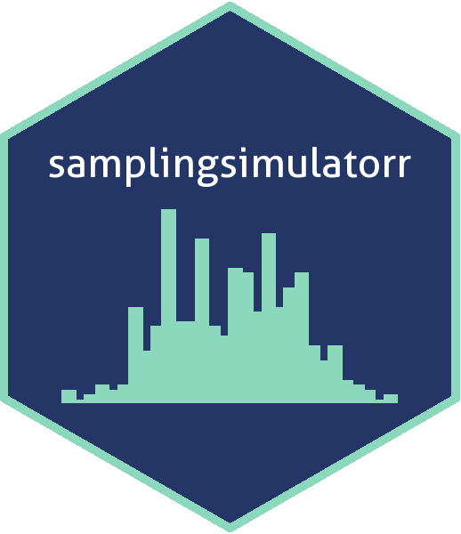

<!-- README.md is generated from README.Rmd. Please edit that file -->

```{r, include = FALSE}
knitr::opts_chunk$set(
  collapse = TRUE,
  comment = "#>",
  fig.path = "man/figures/README-",
  out.width = "100%"
)
```


# samplingsimulatorr 

<!-- badges: start -->
[](https://github.com/UBC-MDS/samplingsimulatorr/actions)

[](https://codecov.io/gh/UBC-MDS/samplingsimulatorr)


<!-- badges: end -->

`samplingsimulatorr` is an R package intended to assist those teaching or learning basic statistical inference.


### Authors

| Name | GitHub |
|---|---|
| Holly Williams | [hwilliams10](https://github.com/hwilliams10) |
| Lise Braaten | [lisebraaten](https://github.com/lisebraaten) |
| Tao Guo | [tguo9](https://github.com/tguo9) |
| Yue (Alex) Jiang | [YueJiangMDSV](https://github.com/YueJiangMDSV) |

### Overview

This package allows users to generate virtual populations which can be sampled from in order to compare and contrast sample vs sampling distributions for different sample sizes.  The package also allows users to sample from the generated virtual population (or any other population), plot the distributions, and view summaries for the parameters of interest.

## Installation

You can install the development version of samplingsimulatorr from [GitHub](https://github.com/) with:

``` r
# install.packages("devtools")
devtools::install_github("UBC-MDS/samplingsimulatorr")
```
## Function Descriptions

- `generate_virtual_pop` creates a virtual population.
    - **Inputs** : distribution function (i.e. `rnorm`, `rexp`, etc), the parameters required by the distribution function, and the size of the population.
    - **Outputs**: the virtual population as a tibble
- `draw_samples` generates samples of different sizes
    - **Inputs** : population to sample from, the sample size, and the number of samples
    - **Outputs**: returns a tibble with the sample number in one column and value in a second column.
- `plot_sample_hist` creates sample distributions for different sample sizes.
    - **Inputs** : population to sample from, the samples to plot, and a vector of the sample sizes
    - **Outputs**: returns a grid of sample distribution plots
- `plot_sampling_dist` creates sampling distributions for different sample sizes.
    - **Inputs** : samples created by `draw_samples` function, variable of interest, a vector of the sample sizes, and the number of replication for each sample size
    - **Outputs**: returns a list of sampling distribution plots
- `stat_summary`: returns a summary of the statistical parameters of interest
    - **Inputs**: population, samples, parameter(s) of interest
    - **Outputs**: summary tibble
    
#### How do these fit into the R ecosystem?

To the best of our knowledge, there is currently no existing R package with the specific functionality to create virtual populations and make the specific sample and sampling distributions described above. We do make use of many existing R packages and expand on them to make very specific functions. These include:
 - built-in r distribution functions such as `rnorm` to sample from distributions
 - `rep_sample_n` to generate random samples
 - `ggplot2` to create plots
Python pandas already includes some summary statistics functions such as .describe(), however our package will be more customizable. Our summary will only include the statistical parameters of interest and will provide a comparison between the sample, sampling, and true population parameters.

## Dependencies

- dplyr
- rlang
- infer
- magrittr
- gridExtra
- ggplot2

## Usage

#### `generate_virtual_pop`

``` r
library(samplingsimulatorr)
generate_virtual_pop(N, var_name, dist, ... )
```
**Arguments:**

- `N`: The number of samples
- `var_name`: The variable name that we need to create
- `dist`: The distribution that we are generating samples from
- `...`: The arguments required for the distribution function

**Example:**

`pop <- generate_virtual_pop(100, "height", rnorm, 0, 1)`

#### `draw_samples`

``` r
library(samplingsimulatorr)
draw_samples(pop, reps, n_s)
```
**Arguments:**

- `pop` the virtual population as a tibble
- `reps` the number of replication for each sample size as an integer value
- `n_s` the sample size for each one of the samples as an array

**Example:**

`samples <- draw_samples(pop, 3, c(1, 10))`

#### `plot_sample_hist`

``` r
library(samplingsimulatorr)
plot_sample_hist(pop, samples, var_name, n_s)
```
**Arguments:**

- `pop` the virtual population as a tibble
- `samples` the samples as a tibble
- `var_name` the name of the column for the variable that is being generated
- `n_s` a vector of the sample sizes (each sample size needs to be in the `samples` df input)

**Example:**

`plot_sample_hist(pop, samples, height, c(1, 10))`

#### `plot_sampling_hist`

``` r
library(samplingsimulatorr)
plot_sampling_hist(samples, var_name, n_s, reps)
```
**Arguments:**

- `samples` the samples as a tibble
- `var_name` the name of the column for the variable that is being generated
- `n_s` a vector of the sample sizes (each sample size needs to be in the `samples` df input)
- `reps` the number of replication for each sample size as an integer (should be less than or equal to the number of replications in `samples`)

**Example:**

`plot_sampling_hist(samples, height, c(10, 50), 100)`

#### `stat_summary`

``` r
library(samplingsimulatorr)
stat_summary(pop, samples, paramater)
```
**Arguments**

- `population` the virtual population
- `samples` the drawn samples
- `parameter` the parameter(s) of interest

**Example**

`stat_summary(pop, samples, c(mean, median))`

### Example Usage Scenario

```{r}
library(samplingsimulatorr)

# generate population
pop <- generate_virtual_pop(1000, "height", rnorm, 0, 1)
head(pop)
```

```{r}
# create samples
samples <- draw_samples(pop, 100, c(1, 10, 50, 100))
head(samples)
```
```{r, fig.width=14,fig.height=4}
# plot sample histogram
plot_sample_hist(pop, samples, height, c(10, 50, 100))
```

```{r}
plot_sampling_hist(samples, height, c(10, 50, 100), 100)
```


